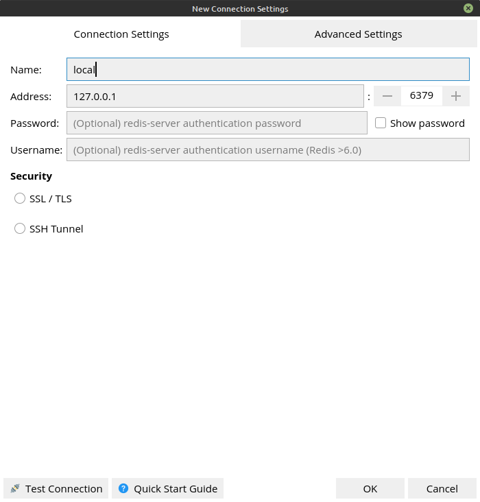
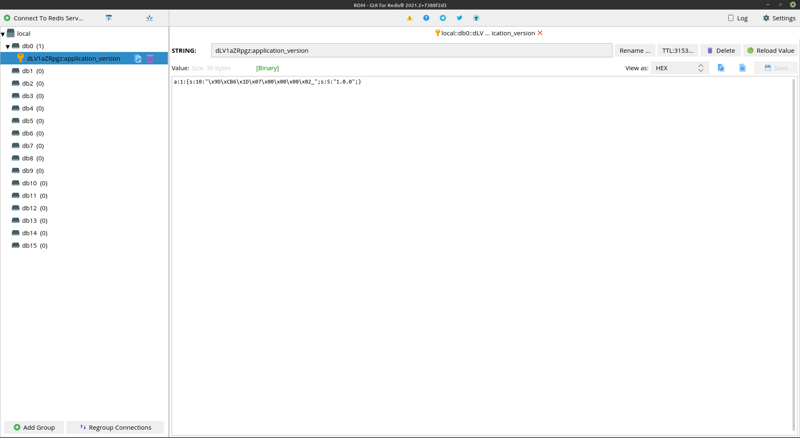

# Redis GUI
This document describing how you can use [RDM](https://rdm.dev/) within this environment.

## Using RDM
1. [Install RDM](https://snapcraft.io/redis-desktop-manager)
2. Create new connection:

3. Select db and choose key:

