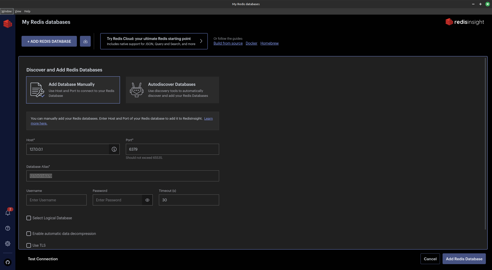
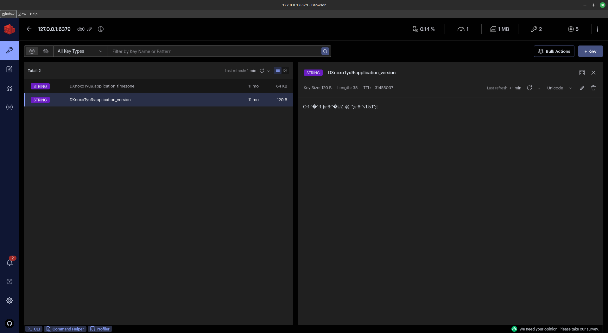

# Redis GUI
This document describing how you can use [RedisInsight](https://redis.com/redis-enterprise/redis-insight/).

## Using RedisInsight
1. [Install RedisInsight](https://redis.com/redis-enterprise/redis-insight/) via your OS Application Manager or download via official web-site
2. Create new connection:

3. Select db and choose key:

